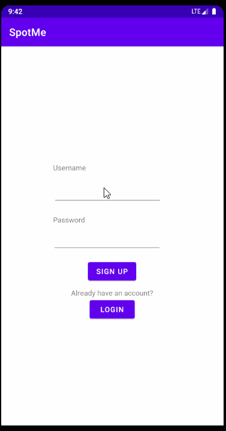

# Spot Me

## Table of Contents
1. [Overview](#Overview)
1. [Product Spec](#Product-Spec)
1. [Wireframes](#Wireframes)
2. [Schema](#Schema)

## Overview
### Description
A social app where it allows users to connect with other fitness enthusiast to workout together. Users have their own profile 

### App Evaluation

- **Category:** Fitness, Social Media
- **Mobile:** Highly mobile, could be implemented as a website
- **Story:** It's compelling, trust me.
- **Market:** Relatively niche however could become a large social network
- **Habit:** Possibly addictive
- **Scope:** Fitness and Social Media

## Product Spec

### 1. User Stories (Required and Optional)

**Required Must-have Stories**

- [x] User can create a new account
- [x] User can login
- [ ] User can input personal records and have personalization
- [ ] User can see other user profiles
- [ ] User can post pictures or videos

**Optional Nice-to-have Stories**

- [ ] Users can see users close to them on the embedded map
- [ ] Users can follow and subscribe to users
- [ ] Gamify app to where users achieve badges after certain completion

### 2. Screen Archetypes

* Register
* Login
* Profile
    * User can acccess pictures/videos
    * User can access post milestones
* Stream 
    * Location-based posts
    * Following
        * Posts from people you follow
* Creation
    * User can create pictures, videos and /or milestones


### 3. Navigation

**Tab Navigation** (Tab to Screen)

* Radius Based Stream 
* Following Based Stream
* Profile
* Creation


**Flow Navigation** (Screen to Screen)

* Following stream
   * Scroll-based stream of posts
* Radius / Location stream
    * Scroll-based stream of posts
* Creation
    * Create posts / milestones
* Profile 
    * User can access posts

### App Walkthough GIF

<br>

## Wireframes


## Schema 
### Models
#### Post

   | Property      | Type     | Description |
   | ------------- | -------- | ------------|
   | objectId      | String   | unique id for the user post (default field) |
   | author        | Pointer to User| image author |
   | image         | File     | image that user posts |
   | caption       | String   | image caption by author |
   | likesCount    | Number   | number of likes for the post |
   | createdAt     | DateTime | date when post is created (default field) |

### Networking
#### List of network requests by screen
   - Home Feed Screen
      - (Read/GET) Query all posts where user is author
         ```swift
         let query = PFQuery(className:"Post")
         query.whereKey("author", equalTo: currentUser)
         query.order(byDescending: "createdAt")
         query.findObjectsInBackground { (posts: [PFObject]?, error: Error?) in
            if let error = error { 
               print(error.localizedDescription)
            } else if let posts = posts {
               print("Successfully retrieved \(posts.count) posts.")
           // TODO: Do something with posts...
            }
         }
         ```
      - (Create/POST) Create a new like on a post
      - (Create/POST) Create a new comment on a post
      - (Delete) Delete existing comment
   - Create Post Screen
      - (Create/POST) Create a new post object
   - Profile Screen
      - (Read/GET) Query logged in user object
      - (Update/PUT) Update user profile image
